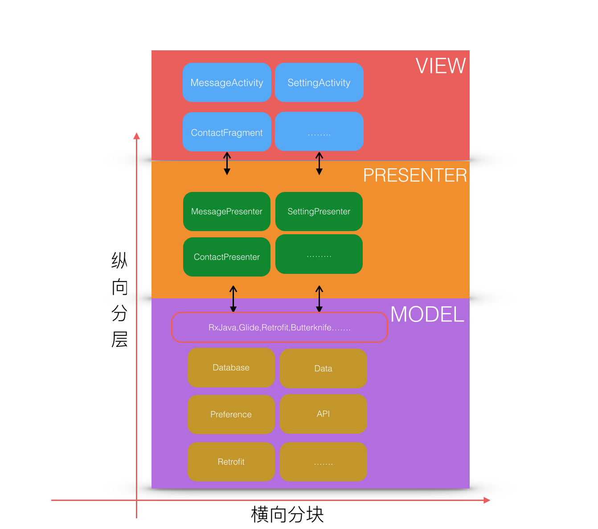
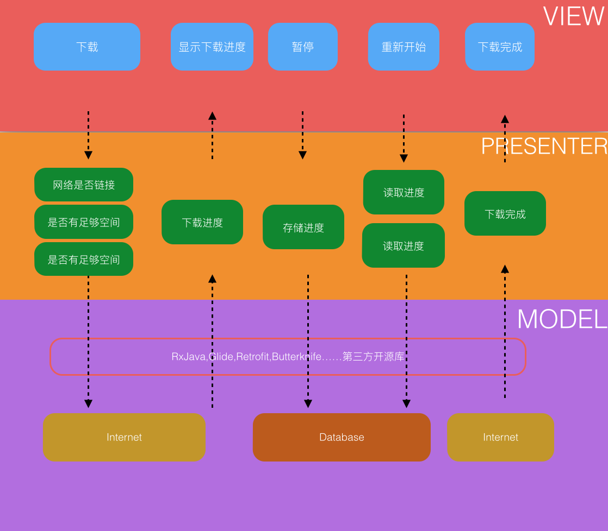

#MVP 架构概述
总体思想是`横向分块，纵向分层`。纵向分为View，Presenter，Model三层，横向按功能模块划分。

- View层：Activitys,Fragmengts,Adapters.主要两个作用：1、向用户显示数据。2、将用户的操作传递到Presenter并接受Presenter传回的数据（如用户的点击、输入）。
- Presenter层：将View层传来的数据进行相关的处理，把请求发送到Model层，然后将Model层返回的数据做处理，交给View层呈现给用户。
- Model层：数据处理中心，根据Presenter层的请求，从不同的资源中获得数据，如数据库，网络，内存等，然后再传回Presenter层。各种开源库

####本项目架构图

####扩展：多线程多任务下载
